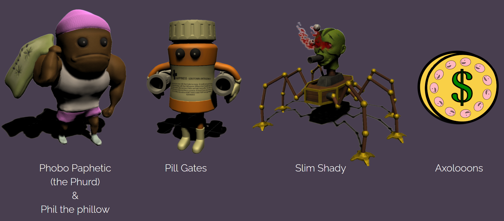

# Phobophobia
3rd Person Tower Defense in a nightmarish psychedelic Setting

## YouTube

 

## Built With
* [Unity](https://unity.com/) - Cross-platform game engine
* [Maya](https://autodesk.com/) - 3D computer graphics application
* [Blender](https://www.blender.org/) - 3D computer graphics application
* [AdvancedSkeleton](https://www.animationstudios.com.au/advanced-skeleton) - Rigging plugin for Maya
* [Substance Painter](https://www.substance3d.com/products/substance-painter/) - Texturing application
* [Substance Designer](https://www.substance3d.com/products/substance-designer/) - Material creation and scan processing tool
* [FMOD Studio](https://www.fmod.com/studio/) - Software for creating adaptive game music and sounds

## Authors
 * [Ultimatonium (me)](https://github.com/Ultimatonium)
 * [Kevin Brantschen](https://kbrantschen.artstation.com)
 * [Gabriel Hubli](https://www.gabrielhubli.com) 
 * [M3tz1](https://github.com/M3tz1)
 * [OmegaKoralle](https://github.com/OmegaKoralle)
 * [Trognic](https://github.com/Trognic)
 * [Xeais](https://github.com/Xeais)

## Audio
 * [Artemis-Archtress](https://github.com/Artemis-Archtress)
 * Carlo
 * [Kaan](https://soundcloud.com/vellum-musik)
 * Yves
